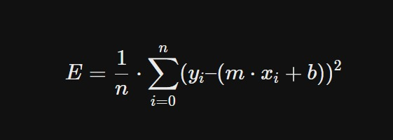
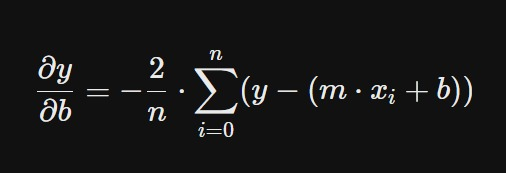
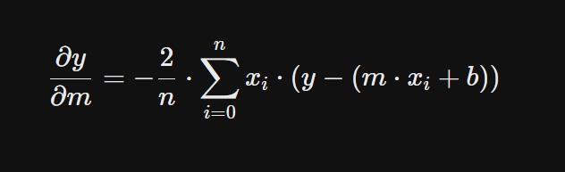
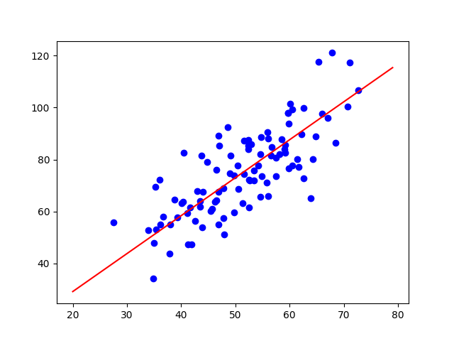

# Linear Regression
One of the most basic machine learning modesls is Linear Regression. The purpose of linear regression is to take a bunch of data points and fit a line through them. This line should be as near as possible from all the points, thats where loss function comes into play.

If the line to be fitted is:
y = m * x + b

Then mean square error can be calculated as

## Gradient Descent

To minimize the error function, we made use of an algorithm known as gradient descent.The basic function of this algorithm is to find local minima, by looking at the slope of curve and taking a small step (Learning Rate) towards the minima. We can do so by calculating partial derivative of the error function and subtracting it from our parameters(Slope and intercept) at each step.

---
The final result plotted using matplotlib is:

